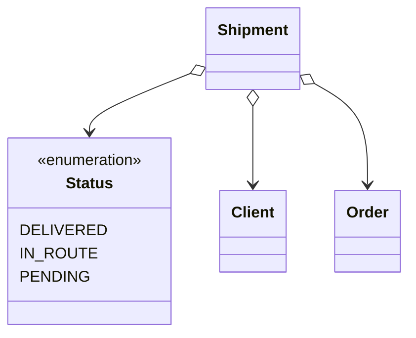

# Realfood-Shipping

Servicio de envíos del TFM del Master CloudApps de la URJC

### Autores

- Juan Antonio Ávila Catalán, [@juanaviladev](https://github.com/juanaviladev)
- Cristo Fernando López Cabañas, [@cristoflop](https://github.com/cristoflop)

Este servicio contiene toda la funcionalidad asociada a los clientes de la aplicación RealFood, esta aplicación consta
de los siguientes componentes:

- [GitHub - Realfood-Clients](https://github.com/MasterCloudApps-Projects/realfood-clients)
- [GitHub - Realfood-Restaurants](https://github.com/MasterCloudApps-Projects/realfood-restaurants)
- [GitHub - Realfood-Payments](https://github.com/MasterCloudApps-Projects/realfood-payments)
- [GitHub - Realfood-Shipping](https://github.com/MasterCloudApps-Projects/realfood-shipping)

Estos servicios se ha desarrollado siguiendo el estilo
de [Arquitectura Hexagonal](https://es.wikipedia.org/wiki/Arquitectura_hexagonal_(software))

Operaciones disponibles en el servicio:

    Operaciones disponibles al iniciar sesion

        - GET       /api/shipments/{shipmentId}         Seguimiento de un pedido

Operaciones de Publicación/Suscripción que ejecuta el servicio:

        - [Publish] Shipment update                     Actualización del estado de un pedido

        - [Consume] Send order request                  Petición de envío de un nuevo pedido

Diagrama de clases del dominio de la aplicación:



Ejemplo de diagrama de clases para el caso de uso Track Shipment:


## Despliegue

### Docker

- Despliegue de recursos (Solo BD y broker de RabbitMq)

```
$ docker-compose -f deploy/docker-compose.yml up --build
```

- Despliegue completo (Recursos y servicio de shipping)

```
$ docker-compose -f deploy/docker-compose-prod.yml up --build
```

- Para observar que se han creado los contenedores:

```
$ docker ps
```

Software recomendado: [Docker desktop](https://www.docker.com/) / [Rancher desktop](https://rancherdesktop.io/)

### Kubernetes

En la carpeta de /deploy están los manifiestos para desplegar los recursos y el servicio

- Arrancar el servicio de minikube

```
$ minikube start
```

- Arrancar broker de RabbitMQ

```
$ kubectl apply -f rabbitmq-pv.yaml

$ kubectl apply -f rabbitmq-pv-claim.yaml

$ kubectl apply -f rabbitmq-deployment.yaml

$ kubectl apply -f rabbitmq-service.yaml
```

- Arrancar BD de clientes

```
$ kubectl apply -f postgres-pv.yaml

$ kubectl apply -f postgres-pv-claim.yaml

$ kubectl apply -f postgres-deployment.yaml

$ kubectl apply -f postgres-service.yaml
```

- Arrancar Servicio de envíos

```
$ kubectl apply -f app-deployment.yaml

$ kubectl apply -f app-service.yaml
```

- Para observar que se han desplegado los servicios:

```
$ kubectl get deployments

$ kubectl get services
```

- Si se quiere levantar todo directamente:
```
$ kubectl apply -f .
```

Software recomendado: [k8sLens](https://k8slens.dev/)
